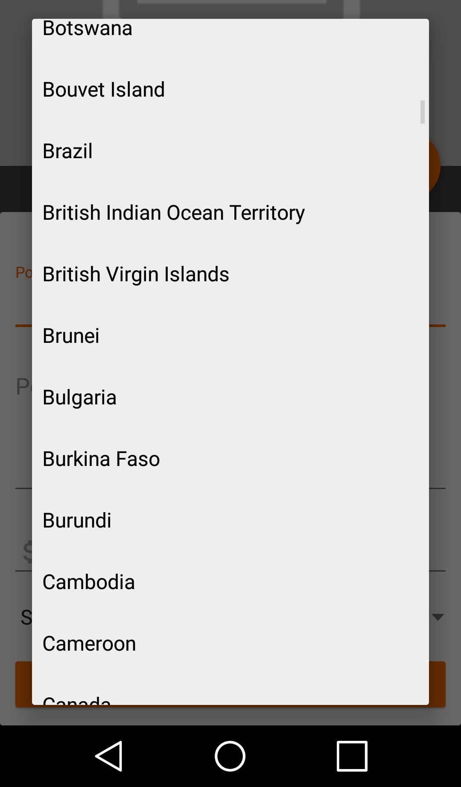

# AwesomePlaces-Android
App for sharing cool places around the world, written in Java for Android.

<h2>DEPENDENCIES</h2>

Circular Image View - https://github.com/hdodenhof/CircleImageView

Image Cropper - https://github.com/ArthurHub/Android-Image-Cropper

Picasso - http://square.github.io/picasso/

Firebase Firestore, Storage & auth - https://firebase.google.com/docs/android/setup

<h2>SCREENS</h2> 

<h4>Login Screen</h4>

  Here the user can access it's account or go to the registration screen to create a new one.  
  Thanks to @eberhardgross on Unsplash.com for the background image!

  <strong>*Uses</strong> Firebase Authentication  

<h4>Register Screen</h4>

  Here the user can create a new account.

  <strong>*Uses</strong> Firebase Authentication, Firebase Firestore, Firebase Storage, Circular Image View & Image Cropper

<h4>Main Screen</h4>

  The main screen is where the all posts are listed.  
  The list is filtered by the date of creation/posting. That way the newest post is always on top.  
  By swiping down on the list, the posts will be updated and rearranged if there are newer ones on the database.  
  By clicking in the fab the user has the option to post a new place.

  <strong>*Uses</strong> Firebase Firestore & Picasso

<h4>Add Place Screen</h4>

  Here the user can add a new place to the database.  

  <strong>*Uses</strong> Firebase Firestore, Firebase Storage & Image Cropper

<h4>Place Detail Screen</h4>

  When the user selects one of the posts in the main screen, he will be taken to the place's detail screen.  
  There will be displayed all of the informations related to the post.  
  On the lower card is listed the comments that other users left on the post.  
  By clicking the "add" icon on the right side, a dialog will slide down and enable the current user to type a comment.

  <strong>*Uses</strong> Firebase Firestore & Picasso

